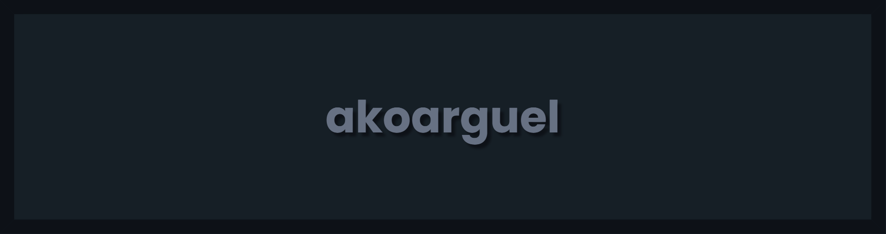

# >_ Manel Argüelles Álvarez

```text
+-------------------------------------------------------------+
|  USUARIO:   Manel Argüelles                                 |
|  UBICACIÓN: Oviedo, Asturias                                |
|  ESTADO:    Estudiante & Desarrollador de Software          |
+-------------------------------------------------------------+

```

> Hola, mundo.

Soy un Desarrollador de Software enfocado en la evolución tecnológica.
Tras completar mi formación en Desarrollo de Aplicaciones Multiplataforma (DAM),
actualmente estoy ampliando mi stack en el IES Doctor Fleming.

[!] OBJETIVO ACTUAL:
    // Cursando Especialización en Inteligencia Artificial y Big Data.
    // Transición hacia roles de desarrollo backend y ciencia de datos.

class Skills:
    def __init__(self):
        self.core = ["Desarrollo Software", "Análisis de Datos"]
        
    def lenguajes(self):
        return {
            "JAVA":   "[##########] 100% - Core",
            "PYTHON": "[########..]  80% - Enfocado en IA/ML",
            "SQL":    "[#########.]  90% - Gestión de BBDD"
        }

    def librerias_ia(self):
        # Perfeccionando actualmente
        return [
            "Pandas",
            "Matplotlib",
            "Scikit-learn"
        ]

+ Historial: Proyectos académicos y prácticas en DAM.
! Estado:    Actualmente sin proyectos públicos recientes (Focus: Estudios).
- Pendiente: Desarrollo de arquitectura compleja post-curso.

>> STATUS: OPEN TO WORK (Buscando activamente oportunidades en desarrollo) <<

[ @ ] Email:    manel.arguelles@gmail.com
